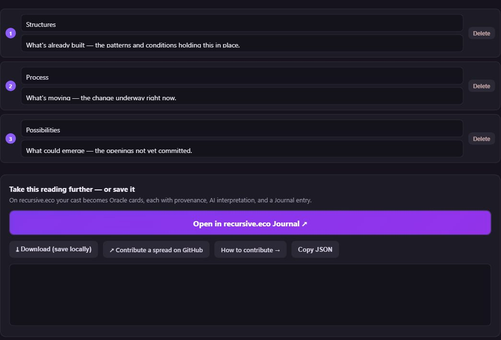

# How to Contribute

Everything in the Recursive Tarot is **open data in one place** — the [recursive-tarot repo](https://github.com/PlayfulProcess/recursive-tarot). The decks are public-domain JSON; the spreads are JSON; these courses are Markdown. If something is wrong or missing, you can fix it — and there are three kinds of thing you can contribute:

- a **deck** (or a correction to one),
- a **spread** (a layout for the Caster),
- a **course** (like this one).

For each there are two routes: the **easy route** — a button, no git knowledge — and the **GitHub route** — edit the file and open a pull request. Take whichever rung you're comfortable on. Every contribution ends the same way: a small, reviewable change that improves the commons for everyone.

> Every change lands on the `dev` branch through a **pull request**, so nothing goes live until it's reviewed. You can't break anything.

## Contribute a deck

A deck is a single file: `tarot/<deck-slug>/grammar.json`. To fix a date, rewrite a description, or add a source —

- **Easy route — in the app.** Open any card on the [card browser](../viewers/cards.html) and use **✎ Edit this card on recursive.eco**. That opens the card in the recursive.eco editor; make your change and follow the editor's *save / contribute* flow — no git, no raw JSON.
- **GitHub route.** Open the deck's `grammar.json` on GitHub, click the ✏️ pencil, edit the text, and choose **Propose changes** — GitHub opens the pull request for you.

> 📷 **Screenshot:** the recursive.eco editor with a card open, the *Contribute / Save to GitHub* control highlighted.

For the full range — from a one-click in-app fix all the way to building a whole new deck with AI and image generation — see the deep-dive: [Contribute to the Commons — Five Ways](course-viewer.html?course=build-a-tarot-deck-with-claude).

## Contribute a spread

A spread is a named layout — where the cards land and what each position means. The [Caster](../viewers/caster.html) builds one for you:

1. Open the **[Caster](../viewers/caster.html)**, choose **Custom**, and drag the positions where you want them (long-press to drag on mobile). Name each position and give it a meaning.
2. Use **⤓ Download** to keep a copy, or **↗ Contribute a spread on GitHub** to offer it to the shared library. The button opens a pre-filled GitHub form — name the file, describe it, and choose **Propose new file**.

Spreads live in `viewers/spreads.json`; a maintainer folds your contribution into it after review.

## Contribute a course

A course is one Markdown file in `course/` — with a little front-matter at the top — plus one line that registers it in the menu.

1. Add `course/<your-course-id>.mdx`. Copy the top of any existing course for the front-matter (`id`, `title`, `description`, `author`, `date`), then write in plain Markdown. YouTube embeds and images work.
2. Register it: add one line to the `COURSE_GROUPS` list in `site-header.js`, under the topic it belongs to — **History**, **Intention Setting**, or **How to Contribute**.
3. Open a pull request.

> 📷 **Screenshot:** a course `.mdx` file open in the GitHub editor, showing the front-matter block at the top.

## The one rule (read this)

Whatever you contribute answers to the same values as the rest of this project:

- **Public domain, with attribution.** Images must be public-domain or your own; name the source and the artist. Never upload a copyrighted image.
- **A gate, not a fate.** If your contribution touches reading or meaning, keep it autonomy-preserving — *a prompt, not a prophecy.* (See [Intention Setting](course-viewer.html?course=intention-setting).)
- **Small and reviewable.** One deck, one spread, one fix at a time. A small pull request is easy to read and quick to merge.
- **Name a school, not a living person** if you add a reading "voice" — and say you were *inspired by* them, never that you speak for them.

That's it. Pick the smallest thing that bothers you, fix it, and propose it. The commons grows one small correction at a time.
