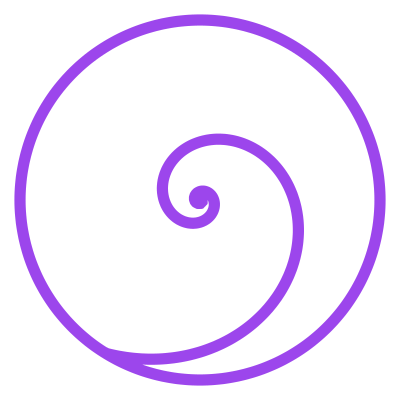

# Ways to Contribute

Everything in the Recursive Tarot is **open data in one place** — the [recursive-tarot repo](https://github.com/PlayfulProcess/recursive-tarot). The decks are public-domain JSON; the spreads are JSON; these courses are Markdown. If something is wrong or missing, you can fix it — and there are three kinds of thing you can contribute:

- a **deck** (or a correction to one),
- a **spread** (a layout for the Caster),
- a **course** (like this one).

For each there are two routes: the **easy route** — a button, no git knowledge — and the **GitHub route** — edit the file and open a pull request. Take whichever rung you're comfortable on. Every contribution ends the same way: a small, reviewable change that improves the commons for everyone.

> Every change lands on the `dev` branch through a **pull request**, so nothing goes live until it's reviewed. You can't break anything.

## Contribute a deck

A deck is a single file: `tarot/<deck-slug>/grammar.json`. To fix a date, rewrite a description, or add a source —

- **Easy route — in the app.** Open any card on the [card browser](../viewers/cards.html) and use the **↻ Open in recursive.eco** button. In the app, **Fork / Edit** the card, make your change, and follow the *save / contribute* flow — no git, no raw JSON.
- **GitHub route.** Open the deck's `grammar.json` on GitHub, click the ✏️ pencil, edit the text, and choose **Propose changes** — GitHub opens the pull request for you.

For the full range — from a one-click in-app fix all the way to building a whole new deck with AI and image generation — see the deep-dive: [Contribute to the Commons — Five Ways](course-viewer.html?course=build-a-tarot-deck-with-claude).

## Contribute a spread

A spread is a named layout — where the cards land and what each position means. The [Caster](../viewers/caster.html) — or the [Spread Studio](../viewers/caster-studio.html), which also casts and sends the reading to recursive.eco for an AI interpretation — builds one for you:

1. Open the **[Caster](../viewers/caster.html)**, choose **Custom**, and drag the positions where you want them (long-press to drag on mobile). Name each position and give it a meaning.
2. Use **⤓ Download** to keep a copy, or **↗ Contribute a spread on GitHub** to offer it to the shared library. The button opens a pre-filled GitHub form — name the file, describe it, and choose **Propose new file**.

Spreads live in `viewers/spreads.json`; a maintainer folds your contribution into it after review.

## Contribute a course

A course is one Markdown file in `course/` — with a little front-matter at the top — plus one line that registers it in the menu.

1. Add `course/<your-course-id>.mdx`. Copy the top of any existing course for the front-matter (`id`, `title`, `description`, `author`, `date`), then write in plain Markdown. YouTube embeds and images work.
2. Register it: add one line to the `COURSE_GROUPS` list in `site-header.js`, under the group it belongs to — **Start here** or **More**.
3. Open a pull request.

## Every deck — and where to correct it

Pick a deck and open it. The **recursive.eco** logo opens the live grammar in the app — read it, then **Fork / Edit** to propose a fix (Rung 1). The **GitHub** logo opens that deck's `grammar.json` straight in GitHub's web editor (Rung 2). Two doors to the same deck — use whichever feels easier.

| Deck | Era | Open · Edit |
|---|---|---|
| **Sola Busca Tarot** | 1491 |  |
| **Ganjifa** | 16th c.+ |  |
| **Tarot de Marseille** | 1760 |  |
| **Court de Gébelin's Tarot** | 1781 |  |
| **Etteilla I** | 1788–89 |  |
| **Tarocchino di Bologna** | 17th c. |  |
| **Golden Dawn Tarot** | 1888 · RWS 1909 |  |
| **Oswald Wirth Tarot** | 1889 |  |
| **Tarot de Besançon / Swiss 1JJ** | 18th–19th c. |  |
| **Mamluk Playing Cards** | c. 1400 (Topkapı c. 1500) |  |
| **Cary-Yale Visconti Tarot** | c. 1442 |  |
| **d'Este Tarocchi** | c. 1450 |  |
| **The 'Charles VI' Tarot (Gringonneur)** | c. 1450–80 |  |
| **Visconti-Sforza Tarot** | c. 1451 |  |
| **The 'Mantegna Tarocchi'** | c. 1465 |  |
| **The Cary Sheet** | c. 1500 |  |
| **The Rosenwald Sheet** | c. 1500 |  |
| **Minchiate** | c. 1506+ |  |
| **Tarot de Paris** | c. 1600–50 |  |
| **Jacques Viéville Tarot** | c. 1650 |  |
| **Jean Noblet Tarot** | c. 1650 |  |
| **Belgian Tarot** | c. 1780 |  |
| **Etteilla II** | c. 1838 |  |
| **Grand Jeu de l'Oracle des Dames (Etteilla III)** | c. 1865 |  |
| **Ma Diao (馬吊)** | money cards, 14th–15th c. |  |

> A few of the rarest sheets aren't published to recursive.eco yet, so they show the GitHub door only for now.

---

## Rung 1 — Fix it in the app (recursive.eco)

The gentlest path. No code, no git.

1. **Sign in** at [recursive.eco](https://flow.recursive.eco) — a free account comes with **$1 of AI credits**.
2. **Find your deck.** Simplest is the **table above** — click a deck's recursive.eco logo and it opens right there in the app. Or, inside recursive.eco, open **Library** and search it by name.

> **Look for the spiral.** Anywhere you're reading a deck in this site — the [card browser](../viewers/cards.html), the [Caster](../viewers/caster.html) — every card carries a small **purple recursive.eco spiral** button: ↻ **Open in recursive.eco ↗**. The same spiral, the same wording, marks every "open this in the app" link across the whole site — so you learn it once and recognise it everywhere.
3. **Fork / Edit** it, correct the text statement, and **propose the change** — it comes to the maintainer (me) to review and merge back into the public deck. Your name rides along in the version history.
4. **Stuck on the UI?** It can feel dense. Open the **Grammar Assistant** (the chat button) and just say what you want — *"fix the date on the Death card to 1450"* — and let it make the edit for you. That's what the free credits are for.

This is the same review-and-merge idea as a GitHub pull request, with none of the git.

---

## Rung 2 — Edit on GitHub (no other tools)

If you're comfortable with a text field, you never need anything but a browser and a free GitHub account.

1. In the table above, click **edit on GitHub** for your deck. GitHub opens the `grammar.json` in its **web editor**.
2. Find the text and fix it. Grammars are just `items` with named `sections` (`Scene`, `Symbol`, `Research note`, `Tradition Note`…) — change the words, keep the quotes and commas.
3. Scroll down, write a one-line note ("corrected Death card date"), and choose **"Create a new branch and start a pull request."**
4. **That's a pull request** — your proposed change, side by side with the original, for the maintainer to review and merge. No install, no command line.

**Keep it honest** (the house rules): public-domain images only; facts in your own words (never paste copyrighted text); and respect the **game-vs-divination** line — most historical decks were *game* decks, so divinatory meaning is flagged as a later layer, not presented as original.

---

## Rung 3 — Work the repo in Claude.ai

When an edit is bigger than one line — rewriting a description, adding sources to every card — let a chat help.

- Open [Claude.ai](https://claude.ai), paste in the deck's `grammar.json` (or the part you're changing), and describe what you want.
- Ask it to **return valid JSON** and to **explain its reasoning and sources**.
- Copy the result back into GitHub's web editor (Rung 2) and open the pull request.

Claude.ai drafts; **GitHub is still where the change lands** and gets reviewed.

---

## Rung 4 — Claude Desktop on the repo

The same workflow, but Claude can read and write the files directly on your machine.

1. Install **Claude Desktop** and **clone** the repo (Claude can run the `git clone` for you): `git clone https://github.com/PlayfulProcess/recursive-tarot.git`
2. Ask it to read `GRAMMAR_FORMAT.md`, then make your edits across many cards at once (e.g. *"add a Research note to every Marseille trump from `research/`"*).
3. Preview locally with a tiny server (`python -m http.server 8000` → open the viewers), then have Claude commit and push a branch and open the PR.

Best when you're improving a **whole deck**, not a single card.

---

## Rung 5 — The recursive.eco MCP (the full toolkit)

The top rung. Connect the **recursive.eco MCP** to Claude and you can act on your library just by *asking* — no files, no manual upload. It runs wherever Claude does — **claude.ai**, **Claude Desktop**, or any MCP-capable client like **Claude Code**. You connect it once (steps below) and sign in; after that, you just talk.

What it can do for you:

- **Create grammars** straight into your library (`create_grammar` → `add_items`).
- **Generate images** with AI, or attach public-domain URLs (`generate_item_image`, `set_item_image`); `commons_image_search` and `wikipedia_summary` find and license-check free art for you — at no credit cost.
- **Import / upload** existing grammars and manage storage.
- **Read & test** as you go — list, fetch, and even **draw a spread** to feel how a deck reads.

**Where does my work go — my library, or the public commons?** This is the important part, and it is always under your control:

- Everything you create or edit through the MCP (or in the app) lands in **your own library first** — private to your account. Nothing you do touches a shared deck automatically.
- It joins the **public commons** only when you say so. `set_grammar_visibility` *publishes* a grammar of your own and opens it to community editing; and an edit to an **existing public deck** is a *proposal* that comes to the maintainer (me) to review and merge — exactly like a pull request. Your name rides along in the version history.

So draft and illustrate freely in your own space; publish or propose only when it's good and well-sourced. Use the MCP to make a personal deck fast, then — if it earns it — open it to the commons.

### Connect it once

No command line needed. In **claude.ai**, open **Settings → Connectors** — they now live under **Customize → Connectors**. Click the **+** button, choose **Add custom connector**, name it *recursive.eco*, and paste the URL:

`https://flow.recursive.eco/api/mcp`

Hit **Add** and you'll be redirected to **log in to recursive.eco** — that sign-in is what lets the MCP read and write *your* library, and draw on *your* credits if you reach for a paid tool. The same URL works in **Claude Desktop**, **Claude Code**, or any MCP-capable client.

### Allow the tools (the one gotcha)

The first time you connect, claude.ai asks **when Claude may use each tool**. If a tool is left on **Ask** and that approval prompt never reaches you, the call simply stalls — you'll see *"No approval received"* and nothing happens. That's claude.ai's own connector gate, **not** a recursive.eco error, and it's the single most common reason "the MCP doesn't work." The fix is one screen.

In **Customize → Connectors → recursive.eco → Tool permissions**, set the tools to **Always allow** — the dropdown at the top right does all of them at once, or flip each one with the green check.

**What you're granting — worth reading.** "Always allow" lets Claude run that tool on *your* library without asking again. The browse-and-read tools (*Cast*, *Commons image search*, list/get) are safe to always-allow. The ones that **spend credits or change things** — *Create grammar*, *Generate image*, *Delete grammar* — you can leave on **Ask** so you confirm each one. Nothing here touches a *shared* deck without your own `set_grammar_visibility`; the permission is only ever about your account and your credits. Allow what you understand; leave the rest on Ask.

**What actually costs credits?** Reading, listing, drawing a spread, publishing, and sourcing public-domain art with `commons_image_search` are all **free**. Credits are only spent on the paid services — **AI image generation, TTS narration, and R2 image hosting**. A free account starts with **$1**, plenty to try them, and you can contribute public-domain work all day without spending a cent. (Power users can read the [full MCP docs](https://code.claude.com/docs/en/mcp), but the paste-the-URL path above is all you need.)

> Honesty note for Rung 5: AI-generated images are wonderful for a personal deck, but the historical decks in this commons are **scanned public-domain art**, not generated. If you publish, say which images are which.

---

## Rung 5 in practice — a real audit-and-improve pass

Here is an actual contribution made with Claude Desktop + the recursive.eco MCP, on **2026-06-20**. Nothing here is a mock-up — these are the real prompts, the real tool calls, and the real results. **You can do this too.** The full narrated build log lives at [`research/build-logs/grammar-audit-mcp-2026-06-20.md`](https://github.com/PlayfulProcess/recursive-tarot/blob/dev/research/build-logs/grammar-audit-mcp-2026-06-20.md).

**The task:** audit the two "sources" grammars — *Books Behind the Tarot* and *People & Institutions of Tarot* — and close the gaps: missing public-domain portraits, missing links between books, people and decks, and one cross-platform bug in the people generator.

### Step 1 — Find public-domain images (don't guess, verify)

The MCP can query Wikimedia Commons directly over HTTP — no browser, no broken screenshot tool. Ask in plain language; Claude calls **`commons_image_search`** and you read the license straight off the result.

The rule is strict and worth repeating: **only `Public domain` / `CC0` / `CC-BY` / `CC-BY-SA` images are accepted**, and you always store the artist/license as a credit string. If nothing is freely licensed, the item stays imageless — you never scrape or guess.

For a person you usually want two things at once — the canonical Wikipedia page (to "redirect" a reader there) *and* a lead portrait. **`wikipedia_summary`** returns both; then a quick `commons_image_search` confirms the license.

A real dead-end from this session: the bare query `"Oswald Wirth portrait"` returned only unrelated scanned book PDFs, so the `wikipedia_summary` lead-image route was used instead, then license-checked on Commons. And **Stuart Kaplan** has no Wikipedia page at all, so he was left imageless on purpose — an honest gap beats a wrong picture.

### Step 2 — Fix the source of truth, keep the gate green

**Why this Python architecture?** Because `people-of-tarot` is **generated** — you never hand-edit its `grammar.json`. The real edits go into the dossiers (`research/people/*.md`) as new front-matter (`image:`, `wikipedia:`, `book:`), and the Python generator was upgraded to emit them — plus a fix to write file paths with forward slashes so Windows and CI stop fighting. One source of truth (the dossiers), one build step, no hand-edited output to drift out of sync. Then the gate must pass:

### Step 3 — Make it live (and open it to everyone)

With the repo work pushed, the same MCP attaches the verified images in one bulk call (**`set_item_images`**, which mirrors each image to R2) and then publishes:

Finally, **`set_grammar_visibility`** publishes each grammar *and* opens it to community editing — the whole point, so the per-deck links resolve for visitors and anyone signed in can propose a fix.

The result is live now:

- **Books Behind the Tarot** → [flow.recursive.eco/g/7ff3ad23-6ceb-4b20-8c27-8bb04d0876ef](https://flow.recursive.eco/g/7ff3ad23-6ceb-4b20-8c27-8bb04d0876ef)
- **People & Institutions of Tarot** → [flow.recursive.eco/g/a284fa37-694f-48dc-b977-f093658bc2b7](https://flow.recursive.eco/g/a284fa37-694f-48dc-b977-f093658bc2b7)

> The five panels above are faithful renderings of the actual MCP/CLI exchanges from this session (the pass was run head-less in Claude Code, not the Desktop GUI). The calls, arguments and results are verbatim; a maintainer can swap in live Desktop captures any time.

---

## Rung 6 — Found your own commons

Here is the quiet part, said plainly: **the point of this repo is to be left.** Rungs 1–5 make you fluent in *one* commons — this one, about tarot. But the method has nothing to do with tarot. A grammar is just named items with sections and links; the viewers are thin; the data is public and portable. Once you can build and publish grammars by talking to Claude, you can do it about **your** thing — your family recipes, your city's trees, a martial-arts lineage, a language you're documenting, the folk songs of a valley. The tarot was only the worked example.

There is already a course for exactly this move, in a sibling repo — **[From Zero to Your First Altar](https://playfulprocess.github.io/nara/course/)** (the *nara* project). It doesn't assume you ever touched this repo; it starts from nothing and walks the whole arc:

1. **What you're building** — a small living library that's *yours*.
2. **Fork a template** — start from a working shape, not a blank page.
3. **A Claude account** — the one tool you'll talk to.
4. **The two manual steps** — connecting the recursive.eco MCP and GitHub (the same two connections Rung 5 taught here — the one screen each that trips everyone up).
5. **Your first grammar** — made by describing it.
6. **Repo discipline** — commit, review, keep it honest.
7. **Offer and share** — open it to whoever it's for.

Everything you practised here transfers one-to-one. Apprentice in this commons until the rungs feel easy; then take the method home and found your own.

---

## Rung 7 — A website like this one

Rung 6 gives you your own *grammars*. Rung 7 gives you your own *site* to show them — a static, backend-free website with the same bones as this one: the shared theme, the card and course viewers, the check-before-you-commit gate, GitHub Pages for free hosting, and a wire back to your recursive.eco channel for the live oracle.

The honest status: **this is the newest rung, and its starter kit is being assembled.** In the meantime you have two working routes today —

- **Fork this repo.** It *is* a working template — clone it, empty the deck menu, drop in one grammar of your own, turn GitHub Pages on, and you have a site like this one within an hour. Read [`GRAMMAR_FORMAT.md`](https://github.com/PlayfulProcess/recursive-tarot/blob/dev/GRAMMAR_FORMAT.md) and the [integration reference](https://github.com/PlayfulProcess/recursive-tarot/blob/dev/docs/RECURSIVE-ECO-INTEGRATION.md) for how the pieces connect.
- **Start from the content template** in the nara course (Rung 6), which is lighter if you don't need all the viewers yet.

A dedicated *"build a site like this one"* starter — the tarot content lifted out, one sample grammar left in, a README that narrates the first hour — is the next thing on the workbench. When it lands it will be linked right here.

---

## Rung 8 — Keep a community

The last rung isn't a tool; it's a role. Once your library is live and others are contributing, you become its **keeper** — you review proposals, welcome new hands, and decide what the commons is *for*. On recursive.eco this grows into your own **channel**: a home others can gather around, and later a way to sustain the work (membership, a pass) so tending a commons can be more than a labour of love.

This rung **depends on machinery still being built** on the recursive.eco side (channels that read and write straight to your repo; the membership model). It's here so you can see the whole ladder — from reading a single card all the way to hosting a commons of your own — even though its top step is still under construction. When it's ready, it will be documented here.

---

## The ethos

You're not filing a bug. You're **tending a commons** — a deck you correct well becomes something a stranger in another country can read, trust, and draw a card from. The repo is public so the work outlives any one of us; the viewers are thin so the **data**, not the platform, is what matters.

Start at whatever rung feels easy. A one-word fix on Rung 1 helps exactly as much as the deck needs.

## The one rule (read this)

Whatever you contribute answers to the same values as the rest of this project:

- **Public domain, with attribution.** Images must be public-domain or your own; name the source and the artist. Never upload a copyrighted image.
- **A gate, not a fate.** If your contribution touches reading or meaning, keep it autonomy-preserving — *a prompt, not a prophecy.* (See [Intention Setting](course-viewer.html?course=intention-setting).)
- **Small and reviewable.** One deck, one spread, one fix at a time. A small pull request is easy to read and quick to merge.
- **Name a school, not a living person** if you add a reading "voice" — and say you were *inspired by* them, never that you speak for them.

That's it. Pick the smallest thing that bothers you, fix it, and propose it. The commons grows one small correction at a time.

## Contribute a video

The **Watch the history** page is fed by public-domain documentaries and talks framed as accounts of the history of tarot. You don't need to touch JSON by hand to add one — give Claude Code a one-line prompt like:

> Add this public-domain YouTube documentary to the "Further watching" watchlist on the Play page: `<paste the URL>`. Check it's public-domain or appropriately licensed, write a one-sentence description framed as an account of tarot history, slot it into the watchlist sequence, and open a pull request.

Claude Code will place it in the sequence and commit it back to the repo. Later we'll grow this into richer programs — the beta "performances" you see on the page — and a course on building those.
